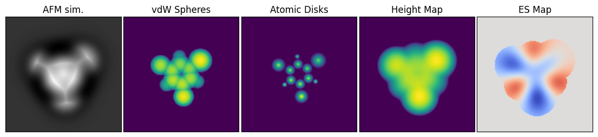

# Molecule image descriptors

Machine learning in atomic force microscopy often uses so-called image descriptors as the learning target.
An image descriptor represents the atomic structure or some other property of a molecule as a 2D map that is more easily interpretable than an AFM image.
Examples of such descriptors include the vdW Spheres, Atomic Disks, Height Map, and Electrostatic Map descriptors used by [Alldritt et al.](https://www.science.org/doi/10.1126/sciadv.aay6913), and [Oinonen et al.](https://pubs.acs.org/doi/10.1021/acsnano.1c06840):



[//]: # (TODO: Image here)

The GPU-accelerated Python API in ppafm provides the ability to generate these image descriptors, which in ppafm are called {mod}`.AuxMap`s.
The following shows how to generate the image descriptors in the above figure.
We will use the [1-bromo-3,5-dichlorobenzene molecule](https://github.com/Probe-Particle/ppafm/blob/main/examples/Generator/example_molecules/bcb.xyz) as the example.

```python
import numpy as np
from matplotlib import pyplot as plt

from ppafm.io import loadXYZ
from ppafm.ml.AuxMap import AtomicDisks, ESMapConstant, HeightMap, vdwSpheres
from ppafm.ocl.AFMulator import AFMulator

# Load a sample
xyzs, Zs, qs, _ = loadXYZ("example_molecules/bcb.xyz")

# The AuxMaps expect the xyz coordinates and point charges to be in the same array
xyzqs = np.concatenate([xyzs, qs[:, None]], axis=1)

# We need an instance of the AFMulator for the HeightMap specifically
afmulator = AFMulator(scan_dim=(128, 128, 30), scan_window=((0, 0, 6), (16, 16, 9)))

# The scan region for the AuxMaps is given in similar way as for the AFMulator, except that it's 2D instead of 3D.
scan_dim = (128, 128)
scan_window = ((0, 0), (16, 16))

# Construct instances of each AuxMap
vdw_spheres = vdwSpheres(scan_dim=scan_dim, scan_window=scan_window, zmin=-1.5, Rpp=-0.5)
atomic_disks = AtomicDisks(scan_dim=scan_dim, scan_window=scan_window, zmin=-1.2)
height_map = HeightMap(scanner=afmulator.scanner, zmin=-2.0)
es_map = ESMapConstant(scan_dim=scan_dim, scan_window=scan_window, vdW_cutoff=-2.0, Rpp=1.0)

# Evaluate each AuxMap for the molecule
y_spheres = vdw_spheres(xyzqs, Zs)
y_disks = atomic_disks(xyzqs, Zs)
y_es = es_map(xyzqs, Zs)

# The HeightMap is special in that it requires the force field for the probe particle to be calculated beforehand,
# so we first run afmulator with the molecule to generate the force field
afm = afmulator(xyzs, Zs, qs)
y_height = height_map(xyzqs, Zs)

# Make a plot
fig, axes = plt.subplots(1, 5, figsize=(14, 4), gridspec_kw={"wspace": 0.02})
axes[0].imshow(afm[:, :, -1].T, origin="lower", cmap="gray")
axes[1].imshow(y_spheres.T, origin="lower")
axes[2].imshow(y_disks.T, origin="lower")
axes[3].imshow(y_height.T, origin="lower")
vmax = max(y_es.max(), -y_es.min())  # Make the ES Map value range symmetric so that zero is in the middle of the color range (white)
vmin = -vmax
axes[4].imshow(y_es.T, origin="lower", cmap="coolwarm", vmin=vmin, vmax=vmax)

axes[0].set_title("AFM sim.")
axes[1].set_title("vdW Spheres")
axes[2].set_title("Atomic Disks")
axes[3].set_title("Height Map")
axes[4].set_title("ES Map")

for ax in axes:
    ax.set_xticks([])
    ax.set_yticks([])

# Save image to disk
plt.savefig("auxmaps.png", bbox_inches="tight")
```

First we load the input molecule geometry from an xyz file on the disk and concatenate the coordinate array and point charge array into a single array:
```python
xyzs, Zs, qs, _ = loadXYZ("example_molecules/bcb.xyz")
xyzqs = np.concatenate([xyzs, qs[:, None]], axis=1)
```
The point charges are used only for the ES Map descriptor and could be substituted for an array of zeros if not needed.

Next we construct one class instance for each of the descriptors we want to evaluate.
During instantiation, we specify the location and resolution of the scan via `scan_dim` and `scan_window` similar to the `AFMulator`, as well as parameters that affect the appearance of the descriptor:

- vdW Spheres:
  ```python
  vdw_spheres = vdwSpheres(scan_dim=scan_dim, scan_window=scan_window, zmin=-1.5, Rpp=-0.5)
  ```
  Here, the `zmin=-1.5` specifies that any region more than 1.5Å below the surface of the highest sphere should be cut off, and the `Rpp = -0.5` says that the radii of the spheres should be reduced by 0.5Å compared to the vdW radii.
- Atomic disks:
  ```python
  atomic_disks = AtomicDisks(scan_dim=scan_dim, scan_window=scan_window, zmin=-1.2)
  ```
  Similar to the previous case, the `zmin=-1.2` cuts off atoms deeper than 1.2Å from the top.
- Height Map:
  ```python
  height_map = HeightMap(scanner=afmulator.scanner, zmin=-2.0)
  ```
  The Height Map is different from the other ones in that the scan is based on the force field that the molecule exerts on the probe particle.
  The scan region is automatically copied from the scanner that calculates the probe particle force field.
  Again, the `zmin=-2.0` cuts off regions deeper than 2.0Å.
- ES Map
  ```python
  es_map = ESMapConstant(scan_dim=scan_dim, scan_window=scan_window, vdW_cutoff=-2.0, Rpp=1.0)
  ```
  For the ES Map, the electrostatic field is by default computed for the whole scan region.
  The additional specification of `vdW_cutoff=-2.0` and `Rpp=1.0` cuts off any regions for which the vdW Spheres descriptor would be cut off with the corresponding parameters.

Finally, all of the descriptors are evaluated using the loaded input molecule:
```python
y_spheres = vdw_spheres(xyzqs, Zs)
y_disks = atomic_disks(xyzqs, Zs)
y_es = es_map(xyzqs, Zs)

afm = afmulator(xyzs, Zs, qs)
y_height = height_map(xyzqs, Zs)
```
The returned values are 2D arrays of the shape specified earlier via `scan_dim`.
Note here how the Height Map requires a separate calculation of the force field, so we evaluate the AFM image before evaluation of the descriptor.
Also note that even thought we use point charges here for evaluating the electrostatic field for the ES Map, we could also calculate it from the Hartree potential by using the `pot` argument of the calling method {meth}`.ESMapConstant.eval`.

The descriptors are only evaluated for a single molecule here, but the constructed instances can be called multiple times in a loop for a database of molecules, which is usually the case when creating datasets for machine learning.
However, there is no need to do this manually, since `ppafm` has an API for generating machine learning datasets, which is the topic of the [next tutorial](generator-tutorial).
