Okay, let's break down the calculation flow and dependencies within the `PauliSolver`.

## 1. Textual Overview

The `PauliSolver` calculates the steady-state probabilities of different electronic configurations (Fock states) of a quantum dot coupled to leads, using the Pauli Master Equation approach. It then uses these probabilities and transition rates to calculate properties like electrical current.

**Core Goal:** Solve the linear system `Kernel * Probabilities = RHS` for `Probabilities`, where the `Kernel` represents the transition rates between states, and `RHS` incorporates the normalization condition (sum of probabilities = 1).

**Data Categories:**

1.  **System Definition (Static):** `nSingle` (number of sites/levels), `nstates` (number of Fock states = 2^nSingle), `nleads`.
2.  **Input Parameters (Often Constant during a scan):**
    *   `TLeads`: Raw tunneling amplitudes between dot sites and leads.
3.  **Input Parameters (Varied during bias scan):**
    *   `Hsingle`: Single-particle Hamiltonian matrix (diagonal elements often shifted by gate/bias).
    *   `W`: Coulomb interaction strength (can sometimes vary, but often constant).
    *   `leads[l].mu`: Chemical potential of lead `l` (shifted by bias).
    *   `leads[l].temp`: Temperature of lead `l` (usually constant).
4.  **Internal Indexing (Static):** Calculated once based on `nSingle`.
    *   `states_by_charge`: Groups state indices by electron count.
    *   `state_order`, `state_order_inv`: Default mapping between original state index and charge-ordered index.
    *   `dictdm`, `lenlst`, `shiftlst*`, `mapdm0`: Various maps for efficient indexing within and between charge sectors.
5.  **Internal Calculated Data (Semi-Static):** Depends on constant inputs.
    *   `coupling`: Effective many-body transition amplitudes between states via leads. Depends *only* on `TLeads` and state definitions (indexing). Calculated once if `TLeads` is constant.
6.  **Internal Calculated Data (Dynamic):** Depends on varied inputs.
    *   `energies`: Energies of the many-body states. Depends on `Hsingle`, `W`. Needs recalculation if `Hsingle` or `W` change.
    *   `pauli_factors`: Forward/backward transition rates between states differing by one electron, including Fermi functions. Depends on `energies`, `leads.mu`, `leads.temp`, and `coupling`. Needs recalculation if energies or lead parameters change.
    *   `kernel`: The rate matrix for the Pauli Master Equation. Depends on `pauli_factors` and indexing. Needs recalculation if `pauli_factors` change.
    *   `probabilities`: Steady-state occupation probability of each state. Depends on `kernel`. Needs recalculation if `kernel` changes.
7.  **Output:**
    *   `current`: Calculated from `probabilities` and `pauli_factors`.

**Calculation Workflow & Dependencies:**

1.  **Initialization (`create_solver`):** Allocate memory based on `nSingle`, `nstates`, `nleads`.
2.  **One-Time Setup (or when these parameters change):**
    *   **Set Tunneling (`set_tunneling` -> `calculate_tunneling_amplitudes` -> `eval_lead_coupling`):**
        *   *Input:* `TLeads`
        *   *Output:* `coupling` matrix
        *   *Dependency:* Only on `TLeads` and static state definitions.
        *   *Optimization:* Calculate **once** before a bias scan if `TLeads` is constant.
    *   **Initialize State Indexing (`init_states_by_charge` and helpers):**
        *   *Input:* `nSingle`, `nstates` (implicit)
        *   *Output:* `states_by_charge`, `state_order`, `dictdm`, `lenlst`, `shiftlst*`, `mapdm0`, etc.
        *   *Dependency:* Only on system size.
        *   *Optimization:* Calculate **once** after solver creation. (Often triggered implicitly by the first `setHsingle`).
3.  **Per Bias Point Calculation (Inside the Scan Loop):**
    *   **Set Parameters (`setHsingle`, `setW`, `set_lead`):**
        *   Update `Hsingle`, `W`, `leads[l].mu`, `leads[l].temp`. These actions flag dependent data as needing recalculation.
    *   **Calculate State Energies (`calculate_state_energies` - often called implicitly by `generate_fct`):**
        *   *Input:* `Hsingle`, `W`
        *   *Output:* `energies` array
        *   *Dependency:* `Hsingle`, `W`.
    *   **Generate Pauli Factors (`generate_fct`):**
        *   *Input:* `energies`, `leads.mu`, `leads.temp`, `coupling`
        *   *Output:* `pauli_factors` array
        *   *Dependency:* State energies, lead parameters, and the (potentially pre-calculated) `coupling` matrix. Uses `fermi_func`.
    *   **Generate Kernel (`generate_kern` -> `generate_coupling_terms` -> `set_matrix_element_pauli`):**
        *   *Input:* `pauli_factors`, static indexing maps
        *   *Output:* `kernel` matrix
        *   *Dependency:* Pauli factors and static state indexing.
    *   **Solve Master Equation (`solve` -> `solve_kern`):**
        *   *Input:* `kernel` matrix
        *   *Output:* `probabilities` array
        *   *Dependency:* Kernel matrix. Solves the linear system.
    *   **Calculate Current (`generate_current`):**
        *   *Input:* `probabilities`, `pauli_factors`, lead index
        *   *Output:* Current for the specified lead
        *   *Dependency:* Steady-state probabilities and transition rates.

**Optimized Scan Flow:**

1.  `create_solver`
2.  `set_tunneling` (calculates `coupling` once)
3.  `init_states_by_charge` (calculates indexing once)
4.  Loop over bias points:
    a.  `setHsingle` / `setW` / `set_lead` (update parameters)
    b.  `generate_fct` (recalculates `energies` internally, then `pauli_factors`)
    c.  `generate_kern` (recalculates `kernel`)
    d.  `solve` (recalculates `probabilities`)
    e.  `generate_current` (calculates output)

## 2. Diagram (using Graphviz `dot`)

This diagram shows the data flow and dependencies. Rectangles represent data, ellipses represent main processing functions/steps. Colors indicate typical behavior during a bias scan:

*   Green: Input, usually constant during scan.
*   Blue: Input, varied during scan (bias-dependent).
*   Orange: Calculated data, often static or semi-static (calculated once or rarely).
*   Red: Calculated data, dynamic (recalculated in the loop).
*   Purple: Final output.

```dot
digraph PauliSolverFlow {
    rankdir=LR; // Left-to-right layout is often good for flow
    splines=ortho; // Use orthogonal lines for cleaner look

    node [shape=rect, style=filled];

    // Input Nodes
    subgraph cluster_inputs {
        label="Inputs";
        style=dashed;
        node [fillcolor="#C8E6C9"]; // Light Green
        TLeads [label="TLeads\n(Tunneling Amplitudes)"];
        nSingle [label="nSingle, nstates, nleads\n(System Size)"];

        node [fillcolor="#BBDEFB"]; // Light Blue
        Hsingle [label="Hsingle\n(Hamiltonian)"];
        W [label="W\n(Coulomb)"];
        LeadParams [label="Lead μ, T\n(mu, temp)"];
    }

    // Process Nodes (Ellipses)
    node [shape=ellipse, style=filled, fillcolor="#FFF9C4"]; // Light Yellow
    proc_Index [label="init_states_by_charge\n(& helpers)"];
    proc_Coupling [label="calculate_tunneling_amplitudes\n(eval_lead_coupling)"];
    proc_Energy [label="calculate_state_energies"];
    proc_Factors [label="generate_fct\n(incl. fermi_func)"];
    proc_Kernel [label="generate_kern\n(generate_coupling_terms)"];
    proc_Solve [label="solve"];
    proc_Current [label="generate_current"];

    // Calculated Data Nodes
    node [shape=rect, style=filled];
    data_Index [label="Indexing Maps\n(states_by_charge, etc)", fillcolor="#FFCCBC"]; // Light Orange (Static)
    data_Coupling [label="Coupling Matrix\n(Many-body Amplitudes)", fillcolor="#FFCCBC"]; // Light Orange (Semi-Static)
    data_Energy [label="State Energies", fillcolor="#FFCDD2"]; // Light Red (Dynamic)
    data_Factors [label="Pauli Factors\n(Rates)", fillcolor="#FFCDD2"]; // Light Red (Dynamic)
    data_Kernel [label="Kernel Matrix", fillcolor="#FFCDD2"]; // Light Red (Dynamic)
    data_Probs [label="Probabilities", fillcolor="#FFCDD2"]; // Light Red (Dynamic)
    data_Current [label="Current", fillcolor="#E1BEE7"]; // Light Purple (Output)


    // Edges showing dependencies

    // --- One-Time Setup ---
    nSingle -> proc_Index;
    proc_Index -> data_Index [label=" Static"];

    TLeads -> proc_Coupling;
    proc_Coupling -> data_Coupling [label=" Semi-Static\n (if TLeads const)"];

    // --- Per-Step Calculation Loop ---
    Hsingle -> proc_Energy;
    W -> proc_Energy;
    proc_Energy -> data_Energy [label=" Dynamic"];

    data_Energy -> proc_Factors;
    LeadParams -> proc_Factors;
    data_Coupling -> proc_Factors; // Reuses pre-calculated coupling
    proc_Factors -> data_Factors [label=" Dynamic"];

    data_Factors -> proc_Kernel;
    data_Index -> proc_Kernel; // Uses static indexing
    proc_Kernel -> data_Kernel [label=" Dynamic"];

    data_Kernel -> proc_Solve;
    proc_Solve -> data_Probs [label=" Dynamic"];

    data_Probs -> proc_Current;
    data_Factors -> proc_Current; // Current depends on both rates and probs
    proc_Current -> data_Current;


    // Legend (Optional but helpful)
    subgraph cluster_legend {
        rank=sink; // Put legend at the bottom
        label = "Legend";
        node [shape=rect, style=filled, width=2, height=0.5];
        key_const_in [label="Constant Input", fillcolor="#C8E6C9"];
        key_var_in [label="Variable Input", fillcolor="#BBDEFB"];
        key_static_data [label="Static/Semi-Static Data", fillcolor="#FFCCBC"];
        key_dyn_data [label="Dynamic Data (Loop)", fillcolor="#FFCDD2"];
        key_out [label="Output", fillcolor="#E1BEE7"];
        key_proc [label="Process/Function", shape=ellipse, fillcolor="#FFF9C4"];
        key_const_in -> key_var_in -> key_static_data -> key_dyn_data -> key_out -> key_proc [style=invis]; // Layout hint
    }

}
```

**How to Render:**

1.  **Install Graphviz:** If you don't have it, download and install it from [graphviz.org](https://graphviz.org/). Make sure the `dot` command is in your system's PATH.
2.  **Save the Code:** Copy the `dot` code above and save it into a plain text file, for example, `pauli_flow.dot`.
3.  **Run `dot`:** Open a terminal or command prompt, navigate to the directory where you saved the file, and run the `dot` command to generate an image. Common output formats are PNG or SVG (Scalable Vector Graphics):
    *   For PNG: `dot -Tpng pauli_flow.dot -o pauli_flow.png`
    *   For SVG: `dot -Tsvg pauli_flow.dot -o pauli_flow.svg`
    *   For PDF: `dot -Tpdf pauli_flow.dot -o pauli_flow.pdf`
4.  **View:** Open the generated image file (`pauli_flow.png`, `pauli_flow.svg`, etc.) with an appropriate viewer.

This diagram visually reinforces the textual explanation, showing how the initial setup calculates semi-static data (`coupling`, `indexing`) which is then reused in the main loop where bias-dependent inputs (`Hsingle`, `LeadParams`) drive the recalculation of dynamic data (`energies`, `pauli_factors`, `kernel`, `probabilities`) leading to the final current.